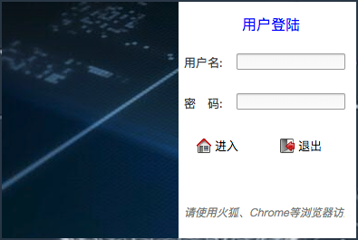
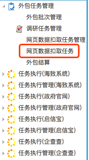
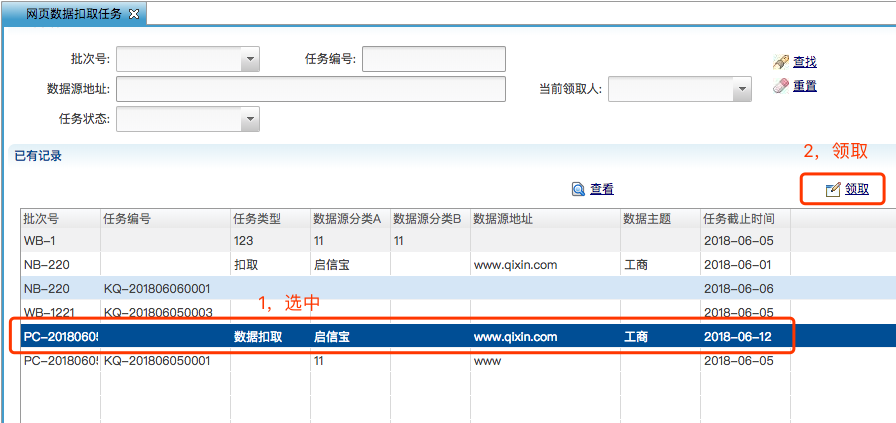
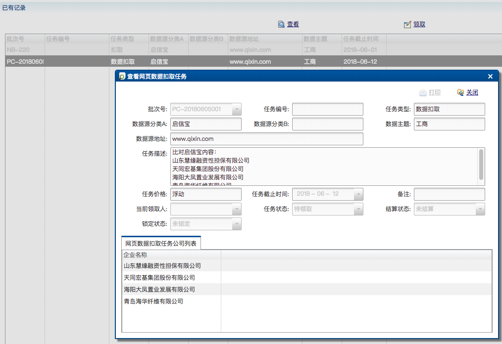
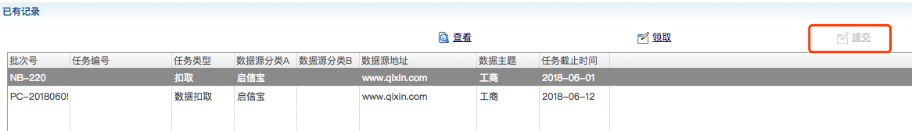
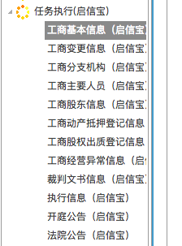
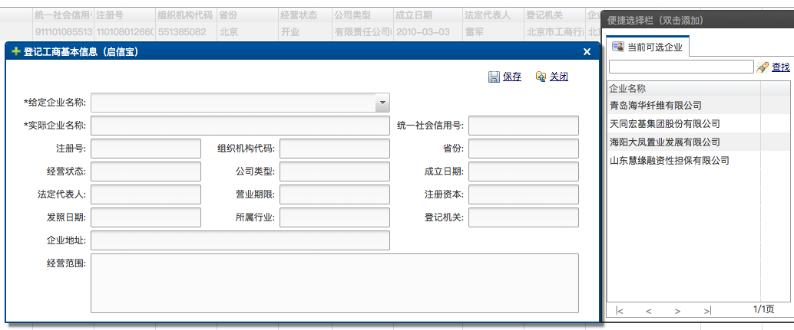
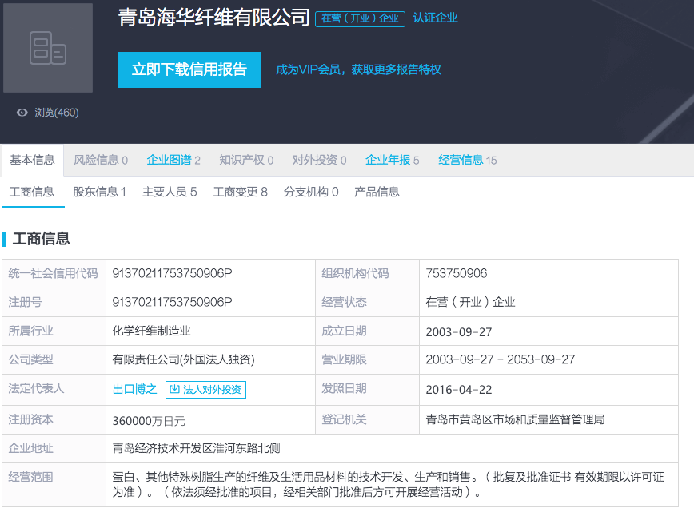
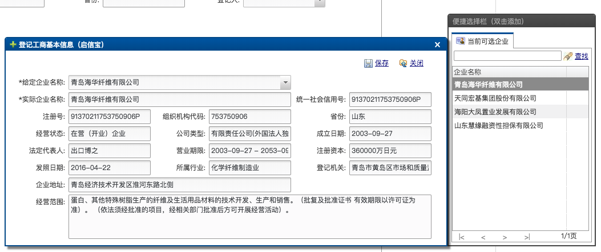
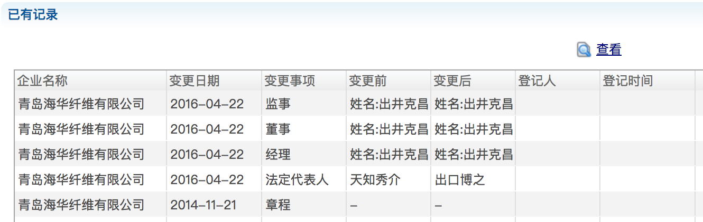

# 外包管理系统使用说明
<!--VERSION: V0.1-->
<!--AUTHOR: Bai-->	

[1.系统登录](#jump1)

[2.任务领取与提交](#jump2)

[3.任务执行](#jump3)

--

### 1.系统登录

<!--待修改-->
外包系统地址：**http://192.168.1.111:10080/**  

进入系统，使用我方给定的用户名，密码登录即可。

---

### 2.任务领取与提交

##### 1. 任务领取（注明不能领取的原因）
* 进入系统后，在左边业务操作栏中选择外包任务管理模块，点击网页数据扣取任务，进入任务领取界面。

  *任务不能领取的原因:已经被别人领取或者任务处于关闭/废弃/锁定等状态。*

* 在任务领取界面中，选中要领取的任务，点击**“领取”**，看到提示“领取成功”即可。

--

##### 2. 任务查看

* 选中任务点击**“查看”**，即可查看任务详情。
* 下方公司列表里就是需要完成数据扣取的公司。

--

##### 3. 任务提交（任务提交前要先完成所有任务内容，详见第三部分）

* 在**任务执行**中填写完任务中所有公司的信息后，点击**“提交”**即可成功提交任务，注意任务提交后不可修改。  
  *任务执行即填写相关详细信息，将在后面介绍。*

*图中此时任务未接取，故提交不可用。*

---

### 3.任务执行

　　任务执行分为海致，政府官网，启信宝和企查查。分别要对应不同的数据源选择不同的执行版块。在任务查看中我们可以看到，数据源分类Ａ的值为启信宝，故此处的任务执行选择启信宝版块。

*注：如果上面的数据源分类Ｂ非空，则此处要同时分别填写两个数据源执行。*

##### 1. 工商基本信息填写
* 此处任务以启信宝为例：首先要填入**工商基本信息**。

* 点击**登记**，弹出登记界面。右侧便捷选择栏可以看到任务中的公司列表，双击或者使用**“给定企业名称”**字段中的下拉菜单可以快速选择每一家企业。

* 登录指定的站点（此处为启信宝:[www.qixin.com](www.qixin.com)），自己注册账号登录。按任务中公司列表中的公司名进行搜索，在搜索结果列表中找到完全相同的公司名打开详情（如果没有完全一致的公司名，就人工判断最相近的公司）。

* 将最终选择的企业名称填写进**“实际企业名称”**字段，将启信宝中的其他基本信息依次填写进系统中的对应输入框中，点击保存即可。

　　注意：个别字段的信息复制可能会出错，需要手动填写。

　　所有数据要保持和展示出来的一致！

--

##### 2. 其他工商信息填写和相关涉诉信息填写

* 其他信息也类似，这里选择工商变更信息板块进行示例。
* 首先，在业务操作栏祖安泽工商变更信息，点击进入登记页面。点击**“登记”**，在便捷选择栏中可以看到在工商基本信息中已经登记的所有企业，同样双击或者在下拉菜单中选择刚才登记的企业名称。
* 在启信宝中找到工商变更信息板块，依次填入不同数据即可。（如果有多个变更信息，则需要多次登记。）

--

* 某部分没有信息可直接不填写。
* 所有部分的信息都填写完毕后方可在任务界面点击**“提交”**按钮提交任务。

--

2018.6.6

